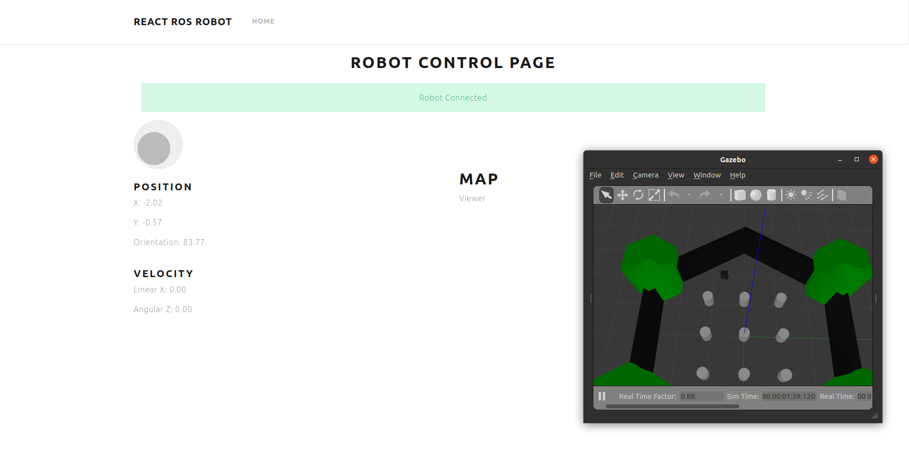

# ROS for Beginners III: Web-based Navigation with ROSBridge
Purpose of the course is to leverage the use of React and JavaScript to control and monitor robot ROS navigation using Web interfaces
<p align="center">
  
  <br>App Demonstration with TurtleBot3
</p>

## Installations
```bash
sudo apt-get install ros-noetic-rosbridge-server
sudo apt-get install ros-noetic-turtlebot3*
npm install roslib
npm install three
```


## App Creation
```bash
npx create-react-app react-ros-robot
```


## How to use 
```bash
npm start
roslaunch rosbridge_server rosbridge_websocket.launch
roslaunch turtlebot3_gazebo turtlebot3_world.launch
roslaunch turtlebot3_navigation turtlebot3_navigation.launch map_file:=/home/oben-n/react-ros-robot/resource/maps/map.yaml
```


## Files and Folders
### node_modules
All the React JS packages are stored here.

### public
`js` folder includes necessary ROS navigation packages to enable web based navigation.

`index.html` file calls the packages in js folder and logo files.

### resource
`maps` folder includes **.pgm** and **.yaml** map files for TurtleBot3.

`media` folder includes video and images.

### src
`bootstrap` folder includes **.css** files that are responsible of appearance (style) of application.

`components` folder includes **.jsx** files that have the main functionality and outline of application. .JSX language is a mixture of Java Script (.JS) and HTML. 
- About.jsx is a header option (not used)
- Body.jsx enables the functionality of navigation bar
- Connection.jsx creates and visualizes the connection between app and robot 
- Footer.jsx gives information about application (not used)
- Header.jsx is the navigation bar of application
- Home.jsx is the layout of Connection, Teleoperation, RobotState and Map sections      
- Map.jsx is 2D Map and robot (arrow) visualization (doesn't work)          
- RobotState.jsx subcribes ROS topics to visualize position and velocity of robot  
- Teleoperation.jsx creates velocity commands respect to the joystick movement

`scripts` folder includes **config.js** file where system parameters are given.
```bash
ROSBRIDGE_SERVER_IP: "192.168.178.22",
ROSBRIDGE_SERVER_PORT: "9090",
RECONNECTION_TIMER: 3000,
CMD_VEL_TOPIC: "/cmd_vel",
ODOM_TOPIC: "/odom",
POSE_TOPIC: "/amcl_pose",
```

`App.css` and `index.css` files are again responsible for the appearance.

`App.js` file calls components file.


## To Do
Fix the problem with **view_map** function in **Map.jsx** file which enables navigation visualization of the robot.